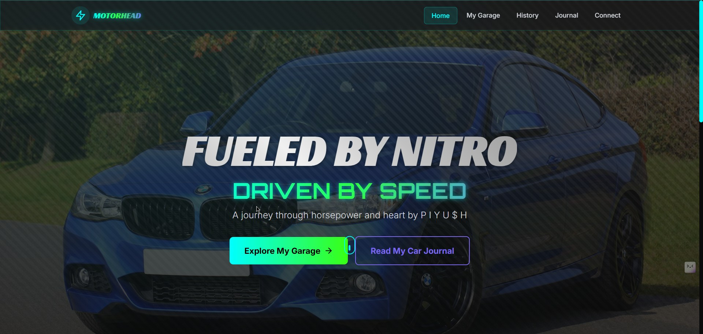

# 🏎️ MotorHead Dream Garage

### *"Where automotive passion meets digital excellence"* 🚗💨

[](https://opensource.org/licenses/MIT)
[](https://reactjs.org/)
[](https://www.typescriptlang.org/)
[](https://vitejs.dev/)
[](https://tailwindcss.com/)

---

## 🎯 What's This About?

**MotorHead Dream Garage** is a sleek, modern web application built for automotive enthusiasts who live and breathe cars! 🚘 Whether you're a weekend warrior, track day enthusiast, or someone who just loves the purr of a perfectly tuned engine, this platform is your digital garage.

This isn't just another car website – it's a celebration of automotive culture, engineering excellence, and the pure joy of driving. From supercars to classics, from technical deep-dives to racing heritage, we've got your motor-loving heart covered! ❤️‍🔥

**Perfect for:**
- 🏁 Car enthusiasts and gearheads
- 🔧 Automotive professionals and mechanics  
- 🏆 Racing fans and motorsport lovers
- 📚 Anyone curious about automotive engineering
- 💭 Dreamers building their ultimate garage

---

## ✨ Key Features

- 🎨 **Stunning Visual Experience** - Smooth animations powered by Framer Motion
- 🚀 **Lightning Fast Performance** - Built with Vite for optimal speed
- 📱 **Fully Responsive Design** - Perfect on desktop, tablet, and mobile
- 🏎️ **Garage Showcase** - Display and explore dream car collections
- 📖 **Rich Content Hub** - Automotive blog, history, and technical insights
- ⚡ **Modern Tech Stack** - React 18, TypeScript, TailwindCSS
- 🎭 **Interactive UI** - Engaging animations and smooth transitions
- 🔍 **Intuitive Navigation** - Easy-to-use routing with React Router
- 🎪 **Custom Loading Experience** - Branded loading screens
- 🌙 **Dark Theme Ready** - Sleek carbon-dark aesthetic

---

## 📸 Preview

### 🏠 Home Page


---

## 🛠️ Tech Stack

This beauty runs on some seriously powerful tech:

- ⚛️ **React 18.3.1** - The heart of our frontend
- 📘 **TypeScript 5.5.3** - Type safety for bulletproof code
- ⚡ **Vite 7.0.0** - Lightning-fast build tool
- 🎨 **TailwindCSS 3.4.1** - Utility-first styling
- 🎭 **Framer Motion 10.16.16** - Smooth animations
- 🧭 **React Router DOM 6.26.1** - Client-side routing
- 🎯 **Lucide React 0.344.0** - Beautiful icons
- 🔧 **ESLint** - Code quality enforcement
- 📦 **PostCSS & Autoprefixer** - CSS processing

---

## ⚙️ Installation

Ready to get your hands dirty? Let's fire up this engine! 🔥

### Prerequisites
- **Node.js** (v16 or higher)
- **npm** or **yarn** package manager

### Quick Start

```bash
# Clone the repository
git clone https://github.com/piyush64-bit/motorhead-dream-garage.git

# Navigate to the project directory
cd motorhead-dream-garage

# Install dependencies
npm install
# or
yarn install

# Start the development server
npm run dev
# or  
yarn dev
```

The app will be running at `http://localhost:5173` 🌐

---

## 🚀 Usage Guide

### Development Commands

```bash
# Start development server
npm run dev

# Build for production
npm run build

# Preview production build
npm run preview

# Lint code
npm run lint
```

### Project Structure

```
src/
├── components/          # Reusable UI components
│   ├── layout/         # Navigation & Footer
│   └── ui/             # Common UI elements
├── pages/              # Route components
├── hooks/              # Custom React hooks
└── styles/             # Global styles & config
```

### Adding New Features

1. **New Pages**: Add components in `src/pages/`
2. **UI Components**: Create reusable components in `src/components/ui/`
3. **Routing**: Update routes in `src/App.tsx`
4. **Styling**: Use TailwindCSS utility classes

---

## 🛠️ Contributing

We love contributions from fellow car enthusiasts! 🚗💙

### How to Contribute

1. **Fork** the repository
2. **Create** a feature branch (`git checkout -b feature/amazing-feature`)
3. **Commit** your changes (`git commit -m 'Add some amazing feature'`)
4. **Push** to the branch (`git push origin feature/amazing-feature`)
5. **Open** a Pull Request

### Contribution Guidelines

- 📝 Write clear, descriptive commit messages
- 🧪 Test your changes thoroughly
- 📚 Update documentation if needed
- 🎨 Follow the existing code style
- 🚀 Keep PRs focused and atomic

---

## 🧑‍💻 Creator

**Built with ❤️ by Piyush Soni**

- 🐙 **GitHub**: [@piyush64-bit](https://github.com/piyush64-bit)
- 💼 **LinkedIn**: [piyush64bit](https://linkedin.com/in/piyush64bit)
- ✉️ **Email**: piiyush.sonii@outlook.com

*"Turning automotive dreams into digital reality, one commit at a time!"* 🏁

---

## 📄 License

This project is licensed under the **MIT License** - see the [LICENSE](LICENSE) file for details.

---

## ❤️ Show Some Love

If this project revved your engine, don't forget to:

⭐ **Star this repository** to show your support!  
🔄 **Share** it with fellow car enthusiasts  
🐛 **Report bugs** or suggest features via issues  
🤝 **Contribute** to make it even better!

---

*Ready to build your dream garage? Let's hit the road! 🏁🚗💨*

---

<div align="center">
  
  <p><strong>MotorHead Dream Garage</strong></p>
  <p><em>Where passion meets performance</em></p>
</div>